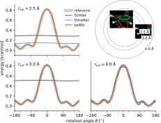

# SchNet
and
# PaiNN

---

# GNNs
and Message Passing

notes:
- conventional NNs are not enough for graphs

- we want to avoid having to craft features manually

- do we want a separate slide for "atom embeddings"?

|||

notes:
conventional NNs are designed for sequential information

|||

|||

`\[
\begin{align}
\mathbf{m}_i^{t+1} &= \sum\limits_{j \in \mathcal{N}(i)}
    \mathbf{M}_t (\mathbf{s}_i^t, \mathbf{s}_j^t, \vec{r}_{ij}) \\
\mathbf{s}_i^{t+1} &=
    \mathbf{U}_t (\mathbf{s}_i^t, \mathbf{m}_i^{t+1})
\end{align}
\]`

notes:
a type of GNN -- what makes it special?

I think GNNs all involve something similar to message passing called "graph
convolution", where features of nodes are updated on every layer (or to think
procedurally, in every timestep) based on the features of the surrounding
nodes (and the features of the node in question).

Message passing is special in that it
  1) distinguishes pairwise message-passing and nodewise update steps
  2) involves edge-features as well as node features

The idea that messages are exchanged between neighbouring nodes, and are
"conditioned" by the edges they pass through, before being aggregated at their
destination -- is justification for the name "message passing".

|||

notes:
So why are GNNs suitable 

- properties of an atom in a molecule depend on two things:
  - atom type (modelled by initial /embedding/)
  - interactions with other atoms (modelled by convolution / /message passing/)
- MPNN formalized by a chemistry paper (Gilbert, 2007?)

---

# Invariance
## and
# Equivariance

|||

`\[
f: \mathbb{V} \to \mathbb{W}
\qquad
G: \begin{cases}
    \mathbb{V} \to \mathbb{V} \\
    \mathbb{W} \to \mathbb{W}
\end{cases}
\]`

`$f~$` invariant _wrt_ `$~G$`:
`\[
f(x \cdot v) = f(v)
    \quad \forall v \in \mathbb{V}, x \in G
\]`
 
`$f~$` equivariant _wrt_ `$~G$`:
`\[
f(x \cdot v) = \color{red}{x \cdot} f(v)
    \quad \forall v \in \mathbb{V}, x \in G
\]`

notes:
mathematical definition

|||

`\[
\tiny
\begin{align}
G &= \{e, \sigma \} \\
f(r, g, b) &= \begin{cases}
    (0, 0, 0) & \text{ if } r = g = b = 0 \\
    (255, 255, 255) & \text{otherwise}
\end{cases}
\end{align}
\]`
 <!-- .element: style="width: 40%" -->

`\[
\tiny
f(x \cdot v) = x \cdot f(v)
\]`

|||
<!-- .slide: data-state="render-3d" -->
`\[
\small
R \cdot \vec{\mathbb{f}} (\vec{\mathbb{x}}) =
    \vec{\mathbb{f}} ( R \cdot \vec{\mathbb{x}})
\]`

notes:
what does rotational equivariance look like for molecular features?

|||

\[
\begin{align}
\mathbf{s}' &= \mathbf{f}(\mathbf{s}) \\
\mathbf{s}' &= \lVert \mathbf{s} \rVert^2 \\
\mathbf{s}' &= \left< \vec{\mathbf{v}}_1, \vec{\mathbf{v}}_2 \right>
\end{align}
\]

\[
\begin{align}
\vec{\mathbf{v}}' &= \mathbf{s} \circ \vec{\mathbf{v}} \\
\vec{\mathbf{v}}' &= \mathbf{W} \vec{\mathbf{v}} \\
\vec{\mathbf{v}}' &= \vec{\mathbf{v}}_1 \times \vec{\mathbf{v}}_2
\end{align}  
\]

---

## Equivariance
Rationale

|||

</img>

|||

</img>

\[
\small
\newcommand\rix[1]{
  \frac{\vec{r}_{i#1}}
       {\lVert \vec{r}_{i#1} \rVert}
}
\left\lVert \sum\limits_{j=1}^{N} \rix{j} \right\rVert^2 =
\sum\limits_{j,k} \left< \rix{j}, \rix{k} \right> =
\sum\limits_{j=1}^N \sum\limits_{k=1}^N \cos\alpha_{jik}
\]

notes:
How does the information actually propagate further?

|||

</img>

notes:
- in schnet and painn, r_ij limits info propagation
- direction vector info propagates further than angles

|||

`\[
\small
\vec{\mu} = \sum\limits_{i=1}^{N} \vec{\mu}_\mathrm{atom}(\vec{\mathbf{v}}_i)
          + q_\mathrm{atom}(\mathbf{s}_i) \vec{r}_i
\]`

notes:
Spectra with PaiNN

- dipole moments benefit from equivariant representation
  - go into a bit of detail on what dipole moments are
  - mention multipole expansion -- after all, the article does...

---

# SchNet
workings

|||

`
\[
\mathrm{ssp}(x) = \ln(0.5e^{0.5} + 0.5)
\]
`

|||

|||

|||

`\[
\small
e_k(r_{ij}) = \exp(-\gamma \lVert r_{ij} - \mu_k \lVert^2)  
\]`

---

# PaiNN
workings

notes:

- why are the update and message blocks defined how they are?
  - I have no idea so far, seems super arbitrary (cf. AES algorithm)
- how do learning (back-propagation?) and read-out actually work?
- explain the weird flow diagrams
  - contrast for PaiNN and for SchNet

|||

`
\[
\mathrm{SiLU}(x) = \frac{x}{1 + e^{-k(x-x_0)}}
\]
`

|||

`\[
\tiny
RBF(\vec{r}_{i,j}, n) =
\frac{\sin\left( n\pi \frac{\lVert \vec{r}_{i,j} \rVert}
                           {r_\mathrm{cut}} \right)}
     {\lVert \vec{r}_{i,j} \rVert}
\]`

notes:
reduces filter correlation => initial training faster

|||

</img>

|||

</img>

|||

</img>

|||

</img>

|||

</img>

|||

</img>

---

How does the prediction\
of energies and forces\
differ between SchNet and PaiNN?

\[
\vec{F}_i  = -\frac{\partial E}{\partial \vec{r}_i}
\]

notes:

- PaiNN predicts forces from the gradients of predicted energies
  - even though direct prediction using vectorial features would be possible
  - they do this to ensure consistency (energy conservation)
- how does PaiNN predict energies?
- how does SchNet predict forces
- how does SchNet predict energies

I think energies are actually handled the same in both, as they are scalar
properties and therefore rotationally invariant. Right?
  - Yes. And since forces are calculated by differentiating wrt. atomic
    positions, which are rotationally equivariant in any model, the forces are
    also equivariant.

Both can be /trained/ on forces and/or energies, /I think/.